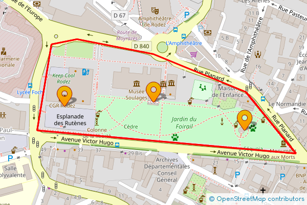

# PHP OpenStreetMap Static API

PHP library to easily get static image from OpenStreetMap with markers and lines.

This project uses the [Tile Server](https://wiki.openstreetmap.org/wiki/Tile_servers) of the Open Streetmap Foundation which runs entirely on donated resources, see [Tile Usage Policy](https://operations.osmfoundation.org/policies/tiles/) for more information.

## ✨ Supporting

⭐ Star this repository to support this project. You will contribute to increase the visibility of this library 🙂

## Installation

Install this library easily with composer :

```cmd
composer require dantsu/php-osm-static-api
```

## How to use

Generate OpenStreetMap static image with marker and line :

```php
use \DantSu\OpenStreetMapStaticAPI\OpenStreetMap;
use \DantSu\OpenStreetMapStaticAPI\LatLng;
use \DantSu\OpenStreetMapStaticAPI\Line;
use \DantSu\OpenStreetMapStaticAPI\Markers;

\header('Content-type: image/png');
(new OpenStreetMap(new LatLng(44.351933, 2.568113), 17, 600, 400))
    ->addMarkers(
        (new Markers(__DIR__ . '/resources/marker.png'))
            ->setAnchor(Markers::ANCHOR_CENTER, Markers::ANCHOR_BOTTOM)
            ->addMarker(new LatLng(44.351933, 2.568113))
            ->addMarker(new LatLng(44.351510, 2.570020))
            ->addMarker(new LatLng(44.351873, 2.566250))
    )
    ->addLine(
        (new Line('FF0000', 2))
            ->addPoint(new LatLng(44.351172, 2.571092))
            ->addPoint(new LatLng(44.352097, 2.570045))
            ->addPoint(new LatLng(44.352665, 2.568107))
            ->addPoint(new LatLng(44.352887, 2.566503))
            ->addPoint(new LatLng(44.352806, 2.565972))
            ->addPoint(new LatLng(44.351517, 2.565672))
            ->addPoint(new LatLng(44.351172, 2.571092))
    )
    ->getImage()
    ->displayPNG();
```



## Documentation

| Class | Description |
|---    |---          |
| [BoundingBox](./docs/classes/DantSu/OpenStreetMapStaticAPI/BoundingBox.md) | DantSu\OpenStreetMapStaticAPI\BoundingBox define the bounding box of the static map.|
| [LatLng](./docs/classes/DantSu/OpenStreetMapStaticAPI/LatLng.md) | DantSu\OpenStreetMapStaticAPI\LatLng define latitude and longitude for map, lines, markers.|
| [Line](./docs/classes/DantSu/OpenStreetMapStaticAPI/Line.md) | DantSu\OpenStreetMapStaticAPI\Line draw line on the map.|
| [Markers](./docs/classes/DantSu/OpenStreetMapStaticAPI/Markers.md) | DantSu\OpenStreetMapStaticAPI\Markers display markers on the map.|
| [OpenStreetMap](./docs/classes/DantSu/OpenStreetMapStaticAPI/OpenStreetMap.md) | DantSu\OpenStreetMapStaticAPI\BoundingBox define the bounding box of the static map.|
| [XY](./docs/classes/DantSu/OpenStreetMapStaticAPI/XY.md) | DantSu\OpenStreetMapStaticAPI\XY define X and Y pixel position for map, lines, markers.|


## Contributing

Please fork this repository and contribute back using pull requests.

Any contributions, large or small, major features, bug fixes, are welcomed and appreciated but will be thoroughly reviewed.

