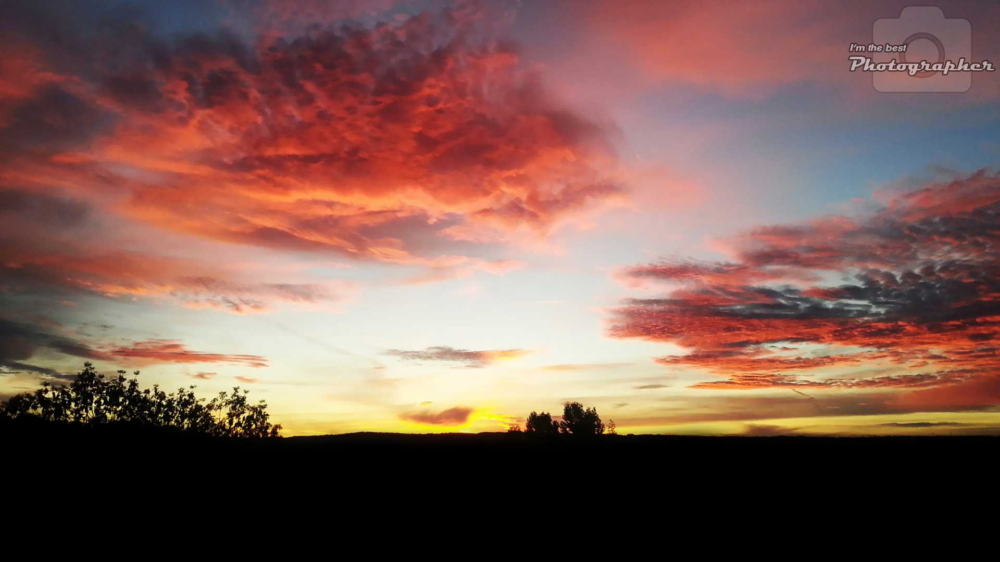

# PHP Image Editor

PHP library to easily edit image with GD extension. Resize, crop, merge, draw, and many more options !

## ✨ Supporting

⭐ Star this repository to support this project. You will contribute to increase the visibility of this library 🙂

## Installation

Install this library easily with composer :

```cmd
composer require dantsu/php-image-editor
```

## How to use

### Example 1

Create a empty image, draw on it and display it :

```php
use \DantSu\PHPImageEditor\Image;

\header('Content-type: image/png');

$image = Image::newCanvas(500, 500)
    ->drawRectangle(0, 0, 500, 500, '#444')
    ->drawRectangle(0, 350, 500, 500, '#FF8800')
    ->writeText('I got the power !', __DIR__ . '/resources/font.ttf', 40, '#FFFFFF', Image::ALIGN_CENTER, 310)
    ->drawCircle(25, 100, 100, '#FF8800')
    ->drawCircle(25, 100, 95, '#000000FF')
    ->drawCircle(475, 100, 100, '#FF8800')
    ->drawCircle(475, 100, 95, '#000000FF');

for($i = 0; $i <= 360; $i+=30) {
    $image
        ->drawArrowWithAngle(250, 200, $i, 80, 2, '#FF8800')
        ->drawArrowWithAngle(250, 200, ($i + 15), 50, 2, '#FF8800');
}

$image
    ->crop(450, 300, Image::ALIGN_CENTER, Image::ALIGN_MIDDLE)
    ->displayPNG();
```


### Example 2

Apply a watermark on a photo and save it :

```php
use \DantSu\PHPImageEditor\Image;

Image::fromPath(__DIR__ . '/resources/photo.jpg')
    ->downscaleAndCrop(1920, 1080, Image::ALIGN_CENTER, Image::ALIGN_BOTTOM)
    ->pasteOn(
        Image::fromPath(__DIR__ . '/resources/watermark.png')->downscaleProportion(300, 300),
        Image::ALIGN_RIGHT,
        Image::ALIGN_TOP
    )
    ->saveJPG(__DIR__ . '/my-image.jpg', 70);
```



## Documentation

See [DantSu\PHPImageEditor\Image](./docs/classes/DantSu/PHPImageEditor/Image.md) documentation class for more details.

## Contributing

Please fork this repository and contribute back using pull requests.

Any contributions, large or small, major features, bug fixes, are welcomed and appreciated but will be thoroughly reviewed.

